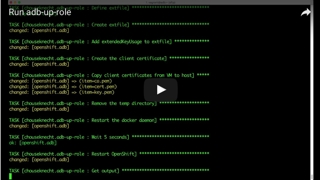
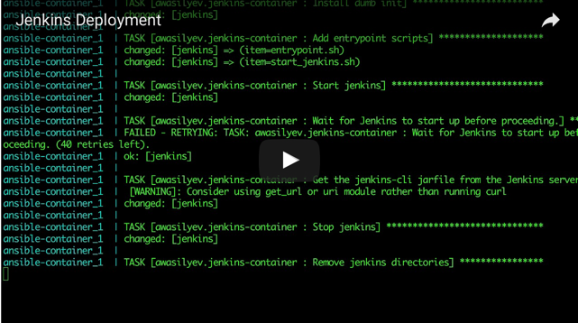

Atomic Developer Bundle
=======================

This guide will help you install and configure `Atomic Developer Bundle (ADB) <https://github.com/projectatomic/adb-atomic-developer-bundle>`_ for use with Ansible Container.

.. contents:: Topics

The adb-up-role
---------------

Use the `adb-up-role <https://galaxy.ansible.com/chouseknecht/adb-up-role>`_ to create an ADB instance, and configure it to work with Ansible Container. It takes care of installing Vagrant plugins, creating the instance, generating certificates, and insalling the ``oc`` client.

The following platforms are supported:

- OSX
- Red Hat

Prerequisites
-------------

- `Ansible 2.1+ <https://github.com/ansible/ansible>`_
- Virtualbox 5.0.26+
- Vagrant 1.9.1+

You will also need *sudo* access to your local machine in order to install the *oc* client, and update */etc/hosts*.

If you want to deploy an Ansible Container project to the OpenShift cluster, you'll need Ansible Container 0.3.0. See `Installing from Source <../installation.rst>`_ if you need assistance.

Install the role
----------------

Use the Ansible Galaxy client, which comes bundled with Ansible, to install the role. If you're not familiar with installing roles, start by establishing a local directory where roles will be installed and executed. The following example creates the directory ``roles`` in your home directory, and then adds ``ANSIBLE_ROLES_PATH=~/roles`` to the login script, ``.bashrc``:

.. code-block:: console

    # Set your home directory as the working directory
    $ cd ~

    # Create the roles directory
    $ mkdir roles

    # Define ANSIBLE_ROLES_PATH in your login script
    $ echo "export ANSIBLE_ROLES_PATH=~/roles" >>.bashrc

.. NOTE::

    The login script name will vary by platform and shell. Use the script that matches your environment.

Now open a new terminal window or tab to create a new session and execute the login script, and then check that *ANSIBLE_ROLES_PATH* is defined:

.. code-block:: console

    # Check the environment for our new variable
    $ env | grep ANSIBLE_ROLES

    ANSIBLE_ROLES_PATH=/home/your_username/roles

To install the role to the new ``~/roles`` directory, run the following:

.. code-block:: console

    # Install the role
    $ ansible-galaxy install chouseknecht.adb-up-role

Run the role
------------

Start by creating a new project directory within your home directory. This directory will hold the Vagrantfile, and a ``.vagrant`` directory, both of which will be created during role execution. The new directory needs to be part of your home directory structure because your home directory is automatically mounted into the new VM.

Copy the bundled playbook to the new directory as well, and then run it as follows, remembering to add the ``--ask-sudo-pass`` option:

.. code-block:: console

    # Create a new project directory in your home directory
    $ mkdir ~/adb

    # Set the working directory to the new directory
    $ cd ~/adb

    # Copy the included playbook
    $ cp $ANSIBLE_ROLES_PATH/chouseknecht.adb-up/files/adb-up.yml .

    # Run the playbook
    $ ansible-playbook adb-up.yml --ask-sudo-pass

After the role completes you will have a running VM that hosts a Docker daemon, and an OpenShift cluster. To access the cluster, open ``https://openshift.adb:8443/console`` in a browser. The username is ``openshift-dev``, and the password is ``devel``.

To use the Docker daemon, source the script ``setenv.sh`` that was added to your project directory. This will set the DOCKER* environment variables in your shell.

Click the following image to view a video showing how to run the role:

Deploy to OpenShift
-------------------

Start by first sourcing the script, *setenv.sh*, which was generated by the role. It will set DOCKER* environment variables in your shell to point the Docker daemon running in the VM. You'll then build your project images using the Docker daemon found on the VM, generate your deployment playbook and role, and then run the playbook.

In the following example we'll create a new project, install the Container Enabled role `jenkins-container <https://galaxy.ansible.com/awasilyev/jenkins-container/>`_, and deploy the Jenkins service to the OpenShift cluster running on the VM.

.. note::

    to run this example, you will need to install Ansible Container 0.3.0

Run the following within the new project directory, ``adb``, that you created to run the role:

.. code-block:: console

    # Set the DOCKER* variables
    $ source setenv.sh

    # Create a new project folder
    $ mkdir jenkins

    # Set the working directory
    $ cd jenkins

    # Init the project
    $ ansible-container init

    # Install the jenkins-container role
    $ ansible-container install awasilyev.jenkins-container

    # Build the images on the ADB virtual machine
    $ ansible-container --no-selinux build

    # Generate the deployment playbook and role
    $ ansible-container --no-selinux shipit openshift --local-images

    # Set the working directory to ansible
    $ cd ansible

    # Run the playbook
    $ ansible-playbook shipit-openshift.yml

To view the project, use a browser to log into the OpenShift console at ``https://openshift.adb:8443/console``. The username is ``openshift-dev``, and the password is ``devel``. If you followed the example above, you will see a ``jenkins`` project. Click on ``jenkins`` to open the project overview.

Click the following image to view a video of the Jenkins service being deploymed to OpenShift running on an ADB virtual machine:

More about the adb-up-role
--------------------------

For additional information, including: variables, specific tasks performed, known issues, license, etc., view the project's `README <https://github.com/chouseknecht/adb-up-role/blob/master/README.md>`_.

