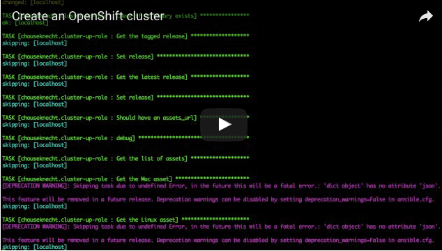
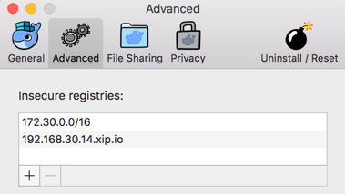

Using Containers
================

This guide will help you create an OpenShift instance using containers. It relies on Docker to pull images and create the containers, so if you already have Docker installed, you're halfway there!

.. contents:: Topics

.. _prerequisites:

Prerequisites
-------------

Access to ports 80 and 443
``````````````````````````
Make sure there are no processes listening on ports 80 and 443. If you're running a local web server that happens to listen on these ports, you'll need to temporarily stop the server, or configure it to listen on different ports. We'll be using ports 80 and 443 to access the local OpenShift registry.

Software packages
`````````````````

Before creating a local OpenShift cluster, you'll need the following installed:

+ `Docker Engine <https://docs.docker.com/engine/installation/>`_ or `Docker for Mac <https://docs.docker.com/docker-for-mac/>`_ (This guide was created using Docker for Mac 1.12.3-beta30.1 (13946)).
+ Install *socat*, if you're using Docker for Mac

  The following will install *socat* using `homebrew <http://brew.sh/>`_:

    .. code-block:: console

        # Install socat
        $ brew install socat

.. _ansible_role:

The cluster-up role
-------------------

The `cluster-up-role <https://galaxy.ansible.com/chouseknecht/cluster-up-role>`_ automates installing the ``oc`` client, and creating and configuring a cluster. It performs all of the tasks outlines in this document.   

To use the role, you'll need Ansible installed. Also note, as demonstrated in the following video, that the playbook used to execute the role is copied from the installed role's file structure. You'll find the playbook, *cluster-up.yml*, in the *files* subfolder.



As noted in the role's `README <https://github.com/chouseknecht/cluster-up-role/blob/master/README.md>`_, if you have not already added the *insecure-registry* option to Docker, the role will error, and provide the subnet or IP range that needs to be added. You'll also need to add the value of the *openshift_hostname* option, which by default is *local.openshift*. For more about adding the insecure-registry option see `Docker's documentation <https://docs.docker.com/registry/insecure/>`_.

.. _install_the_oc_client:

Install the oc client
---------------------

From the `release page <https://github.com/openshift/origin/releases>`_, download the latest stable OpenShift client. At the time of this writing the latest
release was `v1.3.1 <https://github.com/openshift/origin/releases/tag/v1.3.1>`_.

Unzip the downloaded release file, and move the executable into a directory that is part of your *PATH*. The following example demonstrates installing the
client on Mac OSX:

.. code-block:: console

    # Set the working directory to your Downloads directory
    $ cd ~/Downloads

    # Create a temp directory
    $ mkdir tmp

    # Change the working directory to tmp
    $ cd tmp

    # Unzip the release file
    $ unzip ../openshift-origin-client-tools-v1.3.1-2748423-mac.zip

    # As the root user, move the executable to a directory found in your PATH
    $ sudo mv oc /usr/local/bin/oc

Now make sure you can execute the ``oc`` command by running the following test:

.. code-block:: console

    # Set the path to your home directory
    $ cd ~

    # Demonstrate success by getting the client version
    $ oc version

You should see a response similar to the following:

.. code-block:: console

    oc v1.3.1
    kubernetes v1.3.0+52492b4
    features: Basic-Auth

.. _create_hostname:

Create a hostname
-----------------

The installation process associates the cluster with your public IP address. If you're working on a laptop or other mobile device,
your public IP address changes as you move between wireless networks. Each time you change networks, you'll find yourself
recreating the cluster. And so for convenience, it's better to associate local registry access with a hostname.

Start by first finding your IP address. To obtain your IP address on Mac OSX run ``ifconfig en0`` in a terminal window,
and look for the *inet* address. On linux hosts, use the command ``ip addr show eth0``.

Once you have the IP address, open */etc/hosts* in your favorite editor using a privileged account. For example, the following
will open the file using ``vi`` as the *root* user:

.. code-block:: console

    # Open /etc/hosts in vi as root
    $ sudo vi /etc/hosts

Add the following line, replacing the IP address with your IP address, and separating the IP and the hostname with a minimum of one space:

.. code-block:: none

    # Local OpenShift registry access
    192.168.14.30  local.openshift

After saving your changes, check that you can ``ping`` the new hostname by running the following:

.. code-block:: console

    # ping our new hostname
    $ ping -c 3 local.openshift

    PING local.openshift (192.168.30.14): 56 data bytes
    64 bytes from 192.168.30.14: icmp_seq=0 ttl=64 time=0.051 ms
    64 bytes from 192.168.30.14: icmp_seq=1 ttl=64 time=0.129 ms
    64 bytes from 192.168.30.14: icmp_seq=2 ttl=64 time=0.127 ms

Later, when you change networks, modify */etc/hosts* and associate the hostname with the new IP address.

.. _create_the_cluster:

Create the cluster
------------------

The first time you attempt to create the cluster, you will likely get an error about needing to set the ``--insecure-registry``
option, as pictured in the following example:

.. code-block:: console

    # Create the cluster
    $ oc cluster up

    -- Checking OpenShift client ... OK
    -- Checking Docker client ... OK
    -- Checking Docker version ... OK
    -- Checking for existing OpenShift container ... OK
    -- Checking for openshift/origin:v1.3.1 image ... OK
    -- Checking Docker daemon configuration ... FAIL
       Error: did not detect an --insecure-registry argument on the Docker daemon
       Solution:

           Ensure that the Docker daemon is running with the following argument:
     	       --insecure-registry 172.30.0.0/16

           You can run this command with --create-machine to create a machine with the
           right argument.

.. _allow_insecure_registry_access:

Allow insecure registry access
``````````````````````````````

In order to use the private registry that comes installed, Docker must be updated to allow insecure access to the IP address
ranged displayed when you ran the ``oc cluster up`` command, as pictured above as well as the new hostname *local.openshift*
you added earlier to */etc/hosts*.

Once you're ready to add the insecure registries, follow the instructions for the version of Docker you have installed:

+ `Docker Engine <https://docs.docker.com/registry/insecure/>`_
+ `Docker Machine <https://docs.docker.com/machine/reference/create/#/specifying-configuration-options-for-the-created-docker-engine>`_

Docker for Mac
..............

Go to the Docker toolbar menu, choose *Preferences* and open the *Advanced* or *Daemon* tab, and add the addresses to the list of
*Insecure Registries*, as pictured in the following:



.. _restart_the_cluster:

Create the cluster
``````````````````

After adding the insecure registries, run the ``oc cluster up`` command again. The following shows the command completing
successfully:

.. code-block:: console

    # Create the cluster
    $ oc cluster up

    ...

    -- Server Information ...
       OpenShift server started.
       The server is accessible via web console at:
           https://192.168.30.14:8443

       You are logged in as:
          User:     developer
          Password: developer

       To login as administrator:
         oc login -u system:admin

At the end of the output you will see a *Server Information* section, providing instructions for logging in and accessing
the console.

Error restarting the cluster
````````````````````````````

If you're using Docker for Mac, you may receive an error when you run the ``oc cluster up`` command multiple times, as
pictured in the following:

.. code-block:: none

   -- Finding server IP ... FAIL
   Error: cannot determine a server IP to use

This is likely caused by one or more ``socat`` processes that are still running after the cluster was stopped. You'll need
to terminate them before attempting to restart the cluster. The following command will prompt for the *root* password and
execute the ``kill`` command for each process:

.. code-block:: console

    # Terminate any running socat processes
    $ sudo kill -9 $(ps -ef | grep socat | awk '{ print $2 }')

Now attempt to restart the cluster:

.. code-block:: console

    # Create the cluster
    $ oc cluster up

.. _configure_the_cluster:

Configure the cluster
---------------------

Now that you have a running cluster, it's time to apply some configuration. In the next couple sections you'll grant your
account (the developer) admin access, create a route to allow access to the registry, and create a persistent volume for storage.

.. _grant_admin_access:

Grant admin access
``````````````````

Start by giving the developer account admin access to the cluster by running the following commands:

.. code-block:: console

    # Log in as the system user
    $ oc login -u system:admin

    # Give yourself (the developer) admin rights
    $ oc adm policy add-cluster-role-to-user cluster-admin developer

    # Log in as the developer
    $ oc login -u developer -p developer

    # Switch to the default project
    $ oc project default

Going forward, log in using the *developer* account. It now has full access to perform CRUD operations on any object.

Also, a quick note before creating the route. The last command above sets the namespace or project to *default*. The registry is
part of the *default* project, and the route object you're about to create must be created in the *default* project as well.

.. _create_a_route:

Create a route
``````````````
A route exposes a service, allowing access from outside of the cluster. In this case you'll expose the registry service.
With the route in place the registry will be accessible using the new hostname.

Copy the following YAML to a local file called *registry.yml*:

.. code-block:: console

    apiVersion: v1
    kind: Route
    metadata:
      name: registry-access
    spec:
      host: local.openshift
      to:
        kind: Service
        name: docker-registry
        weight: 100
      port:
        targetPort: 5000-tcp
      tls:
        termination: edge
        insecureEdgeTerminationPolicy: Allow
    status:
      ingress:
        -
          host: local.openshift
          routerName: router
          conditions:
            -
              type: Admitted
              status: 'True'

The above configuration defines a route object that allows the registry to be accessed as *https://local.openshift*.

Now execute the following to actually create the route by using the ``oc create`` command to read the definition from the file
you just created:

.. code-block:: console

    # Create the route
    $ oc create -f registry.yml

To test registry access, log in with the ``docker login`` command, using *developer* as the username and the OpenShift access
token as the password. Execute the following command to perform the login:

.. code-block:: console

    # Log into the OpenShift registry
    $ docker login https://local.openshift -u developer -p $(oc whoami -t)

.. _create_a_persistent_volume:

Create a persistent volume
``````````````````````````

Copy the following definition to a file called *persistent.yml*, replacing the *path* with a path that works in your environment.
You will use this definition to create a 10GB persistent volume named *project-data* that will exist as long as the cluster exists.

.. code-block:: yaml

    apiVersion: v1
    kind: PersistentVolume
    metadata:
      name: project-data
    spec:
      capacity:
        storage: 10Gi
      accessModes:
        - ReadWriteOnce
        - ReadWriteMany
      persistentVolumeReclaimPolicy: Retain
      hostPath:
        path: /Users/<your username>/volumes/project-data


Now execute the following to actually create the volume by using ``oc create`` to read the definition from the file you just
created:

.. code-block:: console

    # Create the persistent volume
    $ oc create -f persistent.yml

.. _remove_the_cluster:

Remove the cluster
------------------

When you're done with the cluster, you can remove it by simply running the following:

.. code-block:: console

    # Remove the cluster
    $ oc cluster down

The above will completely remove the OpenShift containers.

If you're running Docker for Mac, you will also want to remove any lingering ``socat`` processes. Executing the follwogin will
prompt for the *root* password and then execute the ``kill`` command on each:

.. code-block:: console

    # Stop any lingering socat processes
    $ sudo kill -9 $(ps -ef | grep socat | awk '{ print $2 }')
